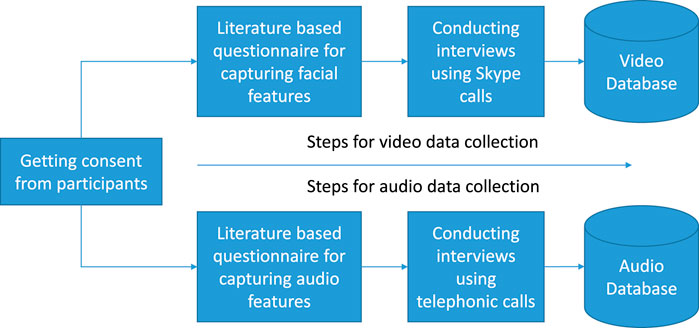
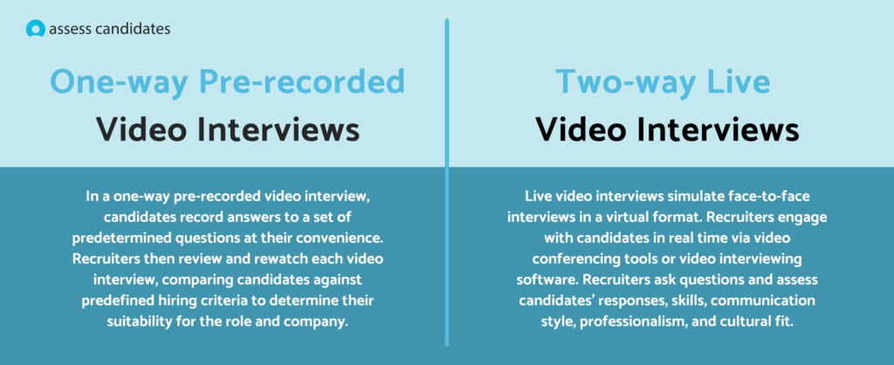

# Smart India Hackathon Workshop
# Date:07.03.2025
## Register Number:212224230209
## Name:Priyadharshini G
## Problem Title
SIH 1653: Web based Selector-Applicant Simulation Software
## Problem Description
Background: Recruitment and Assessment Centre (RAC) under DRDO, Ministry of Defence carries out interviews for applications received against advertised vacancies and for promotion to next higher grade for scientific manpower inducted within DRDO. Description: The process of interviewing is a challenging task. An unbiased objective interviewing process helps identify the right talent. The basic process of an interview involves posing a set of questions by an interviewer and thereafter evaluating responses from candidates. Thus, the questions asked should be relevant and match the area/ expertise of the applicant and the responses should also be of relevance w.r.t. the question asked. Expected Solution: The proposed solution should provide experts as well as candidates a real life Board Room experience, starting with initial ice-breaking questions leading to in-depth techno-managerial (depending on the level of candidate) questions. It shall also be able to provide a quantifiable score for experts as well as the candidate for the relevancy of questions w.r.t. the area/ expertise of the applicant. Similarly, candidate responses should also be graded for relevancy w.r.t. the question asked, finally assisting in arriving at an overall score for the subject knowledge of the candidate and thus his/ her suitability against the advertised post.

## Problem Creater's Organization
Ministry of Defence

## Idea
```
 1.Provides a real-life panel interview experience with video conferencing and session recording.

 2.Automatically generates relevant technical and managerial questions based on the candidate’s expertise.

 3.AI analyzes accuracy, relevance, and confidence in candidate responses using NLP and speech analysis.

 4.Assigns quantifiable scores to both candidate responses and interviewer question relevance.

 5.Generates detailed interview reports with candidate rankings for unbiased selection.

 6.AI suggests follow-up questions and detects inconsistent evaluations to maintain fairness.

 
 ```

## Proposed Solution / Architecture Diagram


## Use Cases


## Technology Stack
1.Frontend – React.js/Angular for UI, WebRTC for video conferencing.

2.Backend – Node.js/Django for APIs, WebSockets for real-time communication.

3'Database – PostgreSQL for structured data, MongoDB for unstructured data.

4.AI & NLP – GPT/BERT for question analysis, Google Speech-to-Text for voice processing.

## Dependencies
1.Cloud & Hosting – AWS/Google Cloud for scalable deployment.

2.Security – OAuth 2.0, JWT for authentication, AES-256 for encryption.

3.Analytics – ELK Stack/Grafana for system monitoring.

4.Integration – Zoom SDK/Jitsi for video calls, Firebase for notifications.